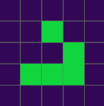

 Game of life
===================================

Simple Cellular automata 2D (Conway's Game of Life) using [p5.js](https://p5js.org)

This project is based on [The Game of Life](https://thecodingtrain.com/CodingChallenges/085-the-game-of-life.html) by Coding Train

Slightly modified it to have more functional code.

## Requirements

You will need [Node.js](https://nodejs.org/en/) to easily install dependencies.

## Get started

You can try it out [here](https://dkostmii.github.io/game-of-life-p5/) or run it **by yourself**:

- Install dependencies by running:
        
        npm install

- Start project with:

        npm run start
        
- **Enjoy it!**
